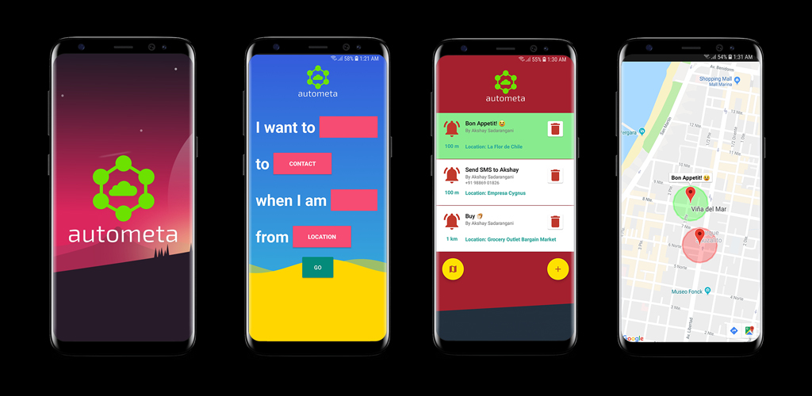

# AUTOMETA 
### Automate location-based tasks

## Introduction
Autometa is an app that triggers reminders and automates text-based events based on the user’s location and radius. Users can snooze or delay events and also cancel them within a specified duration of the trigger.

## What it does
Autometa helps solve memory related problems such as forgetting to notify family and friends of your arrival, forgetting to email peers about delays in meetings due to locational unavailability and forgetting to pick up grocery even while near a grocery store.

## Target audience
The app is targeted at users aged 13 and above. Although the app is simple, it allows for users to control sensitive actions such as auto-texting which would not be apt for children.

## More about Autometa

What is innovative about Autometa is that while some apps do exist which provide location-based reminders, there’s no app which carries out automation such as texting or sending an email based on location. Autometa not only provides an existing feature in a better form but also provides additional useful features in one single app.

Autometa has the potential to be used by users for a long time as short-term memory loss is a natural occurrence and occurs in almost all humans. Autometa aims to solve some of the problems related to exactly that. Short term memory loss in humans will never go away and so the app will always remain useful until an advanced innovation takes place.

The top potential weakness of Autometa is perhaps the location and battery of the phone. Location service is the key to this app’s successful execution and if that doesn’t work, then the app’s functionality is lost. To resolve this, Autometa makes use of not just GPS but also Wi-Fi, Bluetooth and cellular scanning for location. A switched off phone will lead to users missing reminders and so the reminders get snoozed automatically. 

 
